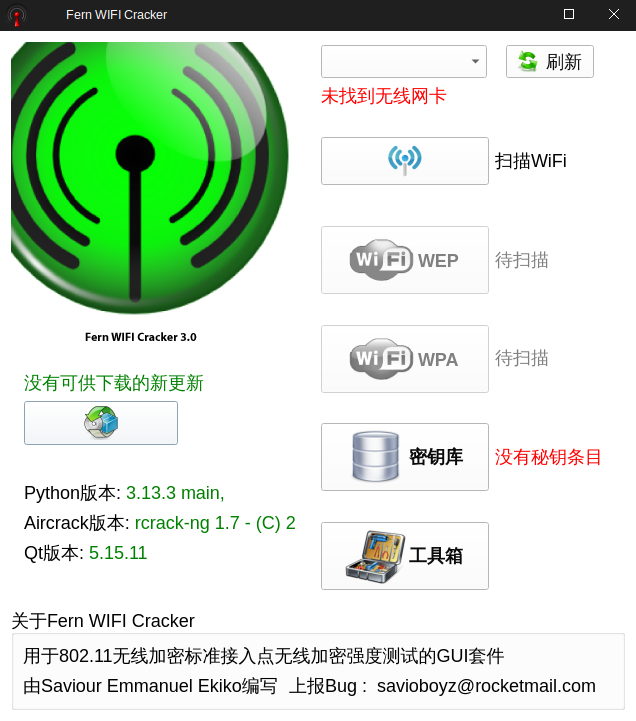
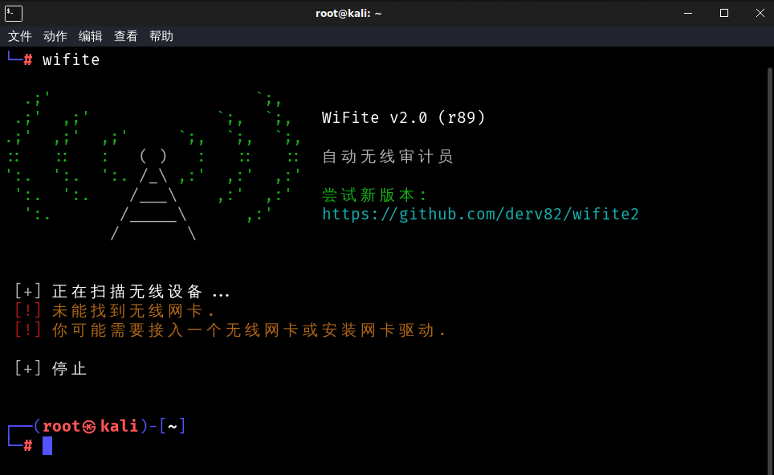
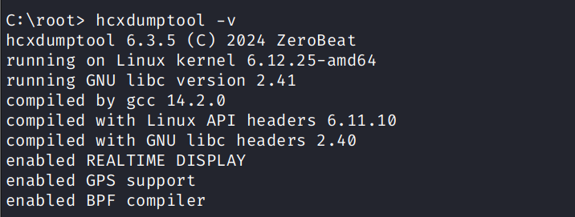
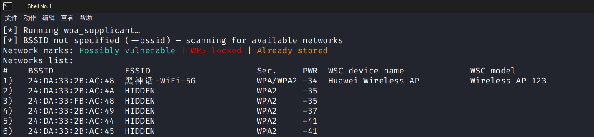
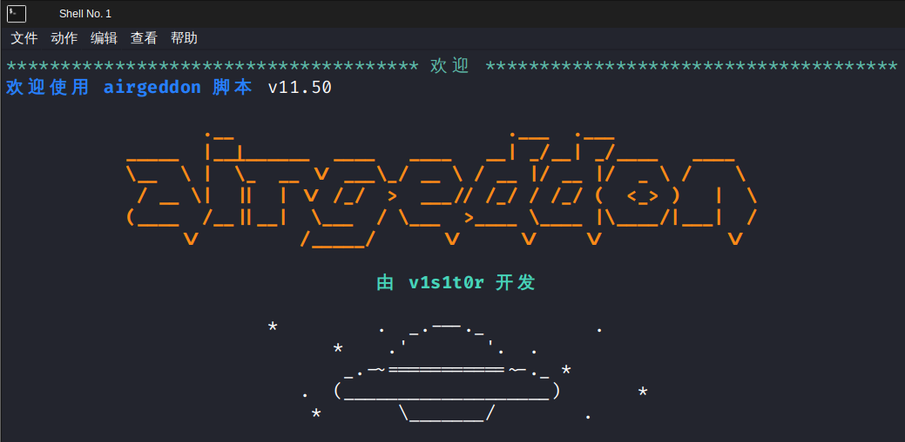
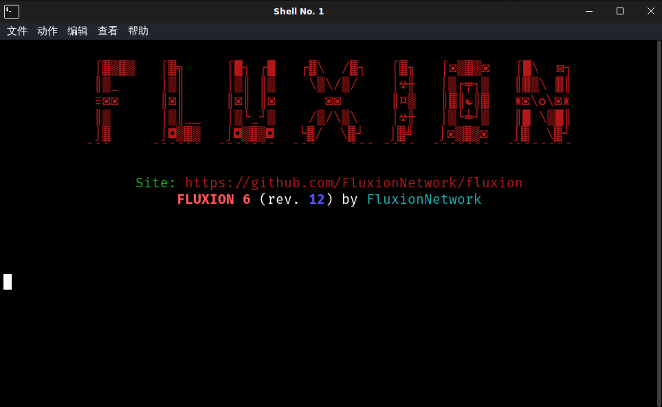
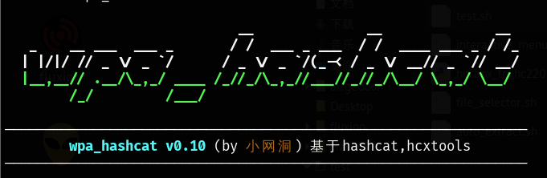

# Kali For WiFi

针对WiFi渗透相关工具定制化封装Kali系统，并做了一系列优化与汉化，操作使用更便捷，适合小白上手学习。

> | 镜像名称 | Kali For WiFi                                          |
> | -------- | ------------------------------------------------------ |
> | 封装作者 | 小网洞                                                 |
> | 封装时间 | 2025.07.27                                             |
> | 封装版本 | 2.0                                                    |
> | 镜像大小 | 3.0 GB                                                 |
> | 封装说明 | 集成常用的WiFi渗透工具、网卡驱动，并做了一定的汉化处理 |
>
> 本资源免费分享，仅供个人下载使用，严禁售卖，若发现有人售卖请立即举报（CSDN、知乎、bilibili同名”**小网洞**“）。
>
> 下载链接：https://pan.xunlei.com/s/VOW8CnBGFoIhJcrKIo_1_BnFA1?pwd=3upm# 
>
> 【注意】请明确清楚你在做什么，否则不要使用该镜像。该镜像仅供个人学习研究使用，注意遵守《中华人民共和国刑法》《中华人民共和国网络安全法》等相关法律，本人不对该镜像使用者的行为所产生的一系列后果负责。

## 系统说明

内核信息：`Linux kali 6.12.33+kali-amd64 #1 SMP PREEMPT_DYNAMIC Kali 6.12.33-1kali1 (2025-06-25) x86_64 GNU/Linux`

### 用户

- 免密登录：设置开机免密登录（使用root用户），同时命令行默认也是root状态
- 默认账密：``root`` / ``kali``

### 桌面

- 汉化：系统切换中文语言

- Windows风格：使用xfce桌面，并使用Undercover Mode伪装windows风格
- 壁纸：自制的暗系风格壁纸，搭配暗系风格界面
- 快捷键：设置了与Windows下类似的几个快捷键，方便用户操作
  - 打开命令行：**Windows键+R**
  - 打开资源管理器：**Windows键+E**
  - 显示桌面：**Windows键+D**
  - 快速搜索：**Windows键+Q**
  - 切换中英文输入：**Shift键**
- 添加重置无线网络按钮，方便使用完抓包工具后关闭网卡监听模式，使其可以连接WiFi

### 其他

- 包管理器：apt-get换源阿里云，修复kali签名过期问题
- 浏览器：默认的火绒浏览器，设置中文，主页为百度
- 输入法：预装了谷歌输入法，以方便中文输入
- QQ：安装了QQ，以方便文件传输、截图等可能的需求

## 内置驱动

- kali官方PCIE/USB网卡驱动（Intel、MediaTek、Atheros相关驱动）：firmware-linux-nonfree
- rtw88 USB网卡驱动（Realtek 8812/8814AU）：https://github.com/lwfinger/rtw88
- rtw89 PCIE网卡驱动（Realtek 8851/8852/8922）：https://github.com/morrownr/rtw89

## 内置程序

系统已预装了基本的无线工具集：**Aircrak-ng(1.7)、Reaver(1.6.6)、mdk3、mdk4、hashcat(6.2.6)**等，除此之外也预装了较为实用的几个WiFi渗透工具如下。

### fern-wifi-cracker

| 程序名   | fern-wifi-cracker                                 |
| -------- | ------------------------------------------------- |
| 简介     | 基于Qt开发的可视化WEP破译、WPA握手包捕获/破译工具 |
| 项目地址 | https://github.com/savio-code/fern-wifi-cracker   |
| 程序版本 | 3.14                                              |

**【程序改动】**

- 对程序进行了汉化
- 优化了启动速度、字体大小，设置默认抓到的握手包保存到桌面
- 修复了一个bug，该bug会导致不支持vif的网卡无法启用监听模式
- 拓展了程序功能，现在支持扫描并捕获5G频段
- 减小攻击时间，增长攻击间隔，以确保客户端能重连成功

### wifite

| 程序名   | wifite                                                       |
| -------- | ------------------------------------------------------------ |
| 简介     | 经典的集WPS破解、WPA握手包捕获/破解为一体的流程化程序        |
| 项目地址 | https://github.com/derv82/wifite2 https://github.com/kimocoder/wifite2 |
| 程序版本 | 2.0（同时也安装了最新的2.7.0版本，但未做汉化）               |

**【程序改动】**

- 对程序进行了部分汉化，并修复了其在中文系统与python3环境下的工作问题
- 阉割了已过时的WPS破解策略，现在选择目标后可以直接进行握手包的捕获
- 修复了一个bug，该bug会导致扫描结果与选择目标的序号对应不上
- 修复了一个bug，将默认握手包检测机制由aircrack-ng改为tshark，避免有时无法检测成功的问题

### hcxdumptool

| 程序名   | hcxdumptool                                                  |
| -------- | ------------------------------------------------------------ |
| 简介     | 新式抓包与握手包处理工具，可无客户端抓包（pmkid），目前仍在更新 |
| 源码地址 | https://github.com/ZerBea/hcxdumptool                        |
| 程序版本 | 6.3.5                                                        |

### oneshot

| 程序名   | oneshot                              |
| -------- | ------------------------------------ |
| 简介     | WPS PIN破解工具                      |
| 源码地址 | https://github.com/kimocoder/OneShot |
| 程序版本 | 0.0.2                                |

【程序改动】

- 自动识别网卡（wlan0）并启动
- 修复了隐藏SSID扫描报错问题（已提交PR并融合）

### airgeddon

| 程序名   | airgeddon                                      |
| -------- | ---------------------------------------------- |
| 简介     | 较新的WiFi钓鱼工具，拥有许多插件，目前仍在更新 |
| 源码地址 | https://github.com/v1s1t0r1sh3r3/airgeddon     |
| 程序版本 | 11.50                                          |

**【程序改动】**

- 默认设置使用中文语言，设置国家码为PA
- 优化了程序启动速度，禁用更新，跳过依赖检测

- 预装了插件，可以自定义钓鱼页面，且能更方便选择握手文件。（来源：https://github.com/KeyofBlueS/airgeddon-plugins）
- 预设了一些实用的钓鱼页面。（来源：https://github.com/QianSong1/airgeddon-plugins）

### fluxion

| 程序名   | fluxion                                                      |
| -------- | ------------------------------------------------------------ |
| 简介     | 老式的WiFi钓鱼工具，目前已停止更新（目前测试存在BUG，无法启动钓鱼页面） |
| 项目地址 | https://github.com/FluxionNetwork/fluxion                    |
| 程序版本 | 6.12                                                         |

**【程序改动】**

- 默认设置使用中文语言
- 优化了程序启动速度，禁用更新，跳过依赖检测

### wpa_hashcat

| 程序名   | wpa_hashcat                                            |
| -------- | ------------------------------------------------------ |
| 简介     | 个人编写的WPA握手包跑包工具，可快速调用hashcat进行跑包 |
| 项目地址 | https://github.com/wangdong0/wpa_hashcat               |
| 程序版本 | 0.10                                                   |

【程序说明】

- 自动转换导入的握手包为hc22000格式使hashcat可以调用

- 内置5个实用预设进行跑包（常用弱密、8位数、手机号、8位数字字母规律、运营商光猫规律）